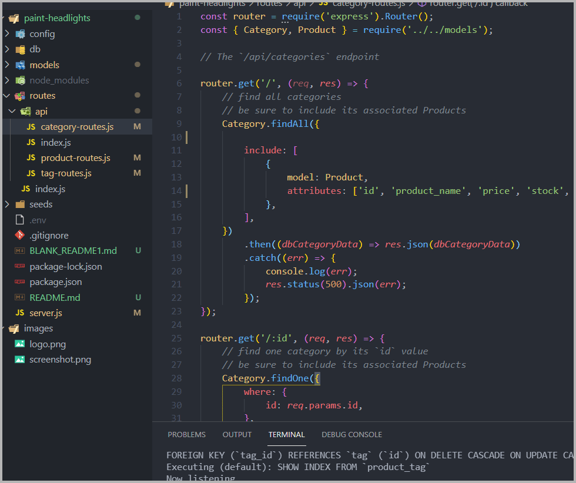

<!-- PROJECT LOGO -->
<br />
<p align="center">


  <h1 align="center">ORM E-Commerce Back End</h1>

  <p align="center">
    A backend for an e-commerce site built using Node.js, Sequelize, MySQL and Express.  Project required modules for Sequelize, routes via Express, MySQL Shell to start schemas and seeds for the MySQL database.
    <br />
    <a href="https://github.com/brandon-stewart-rgb/paint-headlights"><strong>Explore the docs »</strong></a>
    <br />
    <br />
    <a href="https://drive.google.com/file/d/1eGxkZlhuXVClH0YBLuteREh8NIXf1bed/view"> | View Walkthrough Video |</a>
   
   
  </p>
</p>


<!-- TABLE OF CONTENTS -->
<details open="open">
  <summary><h2 style="display: inline-block">Table of Contents</h2></summary>
  <ol>
    <li>
      <a href="#about-the-project">About The Project</a>
      <ul>
        <li><a href="#built-with">Built With</a></li>
      </ul>
    </li>
    <li>
      <a href="#getting-started">Getting Started</a>
      <ul>
        <li><a href="#prerequisites">Prerequisites</a></li>
        <li><a href="#installation">Installation</a></li>
      </ul>
    </li>
    <li><a href="#usage">Usage</a></li>
    <li><a href="#contributing">Contributing</a></li>
    <li><a href="#license">License</a></li>
    <li><a href="#contact">Contact</a></li>
    <li><a href="#acknowledgements">Acknowledgements</a></li>
  </ol>
</details>


<!-- ABOUT THE PROJECT -->
## About The Project

[Walkthrough Video](https://drive.google.com/file/d/1eGxkZlhuXVClH0YBLuteREh8NIXf1bed/view)




### Built With

* [Node.js](https://nodejs.dev/)
* [Sequelize ORM](https://sequelize.org/)
* [Express](https://expressjs.com/)
* [dotenv](https://www.npmjs.com/package/dotenv)
* [npm](https://www.npmjs.com/)


<!-- GETTING STARTED -->
## Getting Started

To get a local copy up and running follow these simple steps.

### Prerequisites

* npm
  ```sh
  npm install npm@latest -g
  ```

### Installation

1. Clone the repo
   ```sh
   git clone https://github.com/brandon-stewart-rgb/paint-headlights.git
   ```
2. Install NPM packages
   ```sh
   npm install
   ```


<!-- USAGE EXAMPLES -->
## Usage

This software is licensed under the:

MIT License

Permission is hereby granted, free of charge, to any person obtaining a copy
of this software and associated documentation files (the "Software"), to deal
in the Software without restriction, including without limitation the rights
to use, copy, modify, merge, publish, distribute, sublicense, and/or sell
copies of the Software, and to permit persons to whom the Software is
furnished to do so, subject to the following conditions:

THE SOFTWARE IS PROVIDED "AS IS", WITHOUT WARRANTY OF ANY KIND, EXPRESS OR
IMPLIED, INCLUDING BUT NOT LIMITED TO THE WARRANTIES OF MERCHANTABILITY,
FITNESS FOR A PARTICULAR PURPOSE AND NONINFRINGEMENT. IN NO EVENT SHALL THE
AUTHORS OR COPYRIGHT HOLDERS BE LIABLE FOR ANY CLAIM, DAMAGES OR OTHER
LIABILITY, WHETHER IN AN ACTION OF CONTRACT, TORT OR OTHERWISE, ARISING FROM,
OUT OF OR IN CONNECTION WITH THE SOFTWARE OR THE USE OR OTHER DEALINGS IN THE
SOFTWARE.

_For more examples, please refer to the [Demo](https://drive.google.com/file/d/1eGxkZlhuXVClH0YBLuteREh8NIXf1bed/view)_


<!-- CONTRIBUTING -->
## Contributing

Contributions are what make the open source community such an amazing place to learn, inspire, and create.

1. Fork the Project
2. Have fun.


<!-- LICENSE -->
## License

Distributed under the MIT License. See `LICENSE` for more information.


<!-- CONTACT -->
## Contact

Brandon Stewart - 

Project Link: [https://github.com/brandon-stewart-rgb/paint-headlights](https://github.com/brandon-stewart-rgb/paint-headlights)


<!-- ACKNOWLEDGEMENTS -->
## Acknowledgements

* [Node.js](https://nodejs.dev/)
* [Sequelize ORM](https://sequelize.org/)
* [Express](https://expressjs.com/)
* [dotenv](https://www.npmjs.com/package/dotenv)
* [npm](https://www.npmjs.com/)

